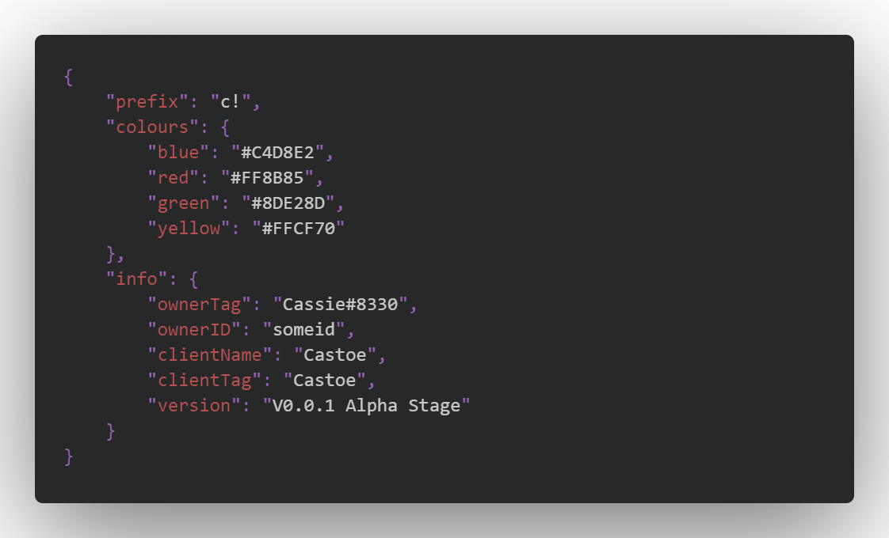

# README
## Darkio
Darkio is a theme based on the dark themes. It uses blue as a main tint. But it uses a variety of colours. The colours aren't supposed to be that much, it's based on a minimal yet readable design. Since the creation isn't fully completed yet, feel free to leave any feedback or errors [here](https://github.com/DevCassie/Darkio/issues).

## Examples

### Full screen example

### JavaScript example

### JSON example

### Information
* Theme created by Cas Martens.

**Enjoy!**
